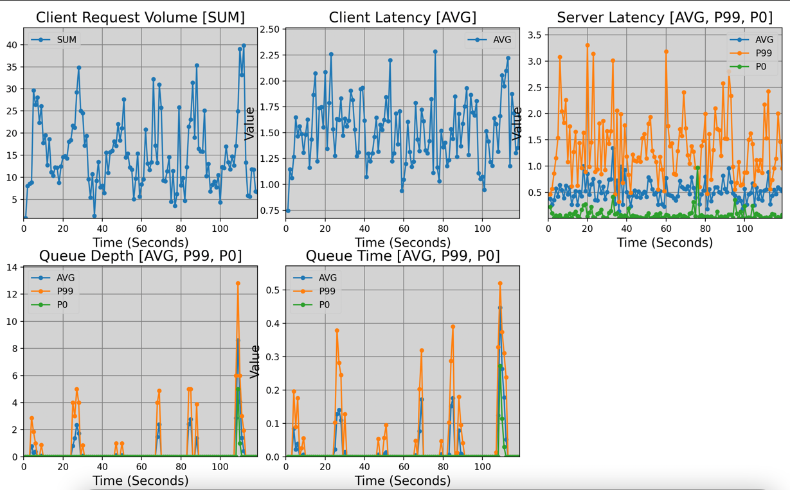

** WORK IN PROGRESS **


# happy-simulator
Simulate systems in a few lines of Python code.

[](https://opensource.org/licenses/Apache-2.0)

## Quick Start
To configure logging, set your `HS_LOGGING` environment variable to `DEBUG`, `INFO`, `WARNING`, `ERROR`. Default is `INFO`.

## Examples 
See `examples/` folder for examples.

The following code simulates a sinusoidal traffic pattern for a server with a queue, and generates CSV file and graphs:

```python
from happysimulator.arrival_distribution import ArrivalDistribution
from happysimulator.distribution.exponential_latency import ExponentialLatency
from happysimulator.entities.client import Client
from happysimulator.entities.queue import Queue
from happysimulator.entities.queued_server import QueuedServer
from happysimulator.events.client_server_request_event import Request
from happysimulator.generator import Generator
from happysimulator.measurement import Measurement
from happysimulator.profiles import SinusoidProfile
from happysimulator.simulation import Simulation
from happysimulator.stat import Stat
from happysimulator.time import Time

client = Client(name="BasicClient")

queue = Queue(name="MyQueue") # unbounded FIFO queue
server = QueuedServer(name="MyQueuedServer",
                      server_latency=ExponentialLatency(Time.from_seconds(0.5)),
                      threads=10,
                      queue=queue)

network_latency = ExponentialLatency(Time.from_seconds(0.5))

profile = SinusoidProfile(shift=10, amplitude=5, period=Time.from_seconds(20))

request_number = 0
request_generator = Generator(func=lambda time: [Request(time=time, client=client, server=server, callback=client.send_request, network_latency=network_latency)],
                              profile=profile,
                              distribution=ArrivalDistribution.CONSTANT)

simulation_run_result = Simulation(
    end_time=Time.from_seconds(120),
    entities=[client, server],
    generators=[request_generator],
    measurements=[
        Measurement(name="Client Request Volume",
                    func=client.requests_latency,
                    stats=[Stat.SUM],
                    interval=Time.from_seconds(1)),
        Measurement(name="Client Latency",
                    func=client.requests_latency,
                    stats=[Stat.AVG],
                    interval=Time.from_seconds(1)),
        Measurement(name="Server Latency",
                    func=server.requests_latency,
                    stats=[Stat.AVG, Stat.P99, Stat.P0],
                    interval=Time.from_seconds(1)),
        Measurement(name="Queue Depth",
                    func=queue.depth,
                    stats=[Stat.AVG, Stat.P99, Stat.P0],
                    interval=Time.from_seconds(1)),
        Measurement(name="Queue Time",
                    func=queue.queue_time,
                    stats=[Stat.AVG, Stat.P99, Stat.P0],
                    interval=Time.from_seconds(1))
    ]
).run()

simulation_run_result.print_csv()
simulation_run_result.display_graphs()
```

Look at how when the traffic volume peaks, we get some queue build up in the server:



There are detailed logs, giving some insight into what the server is up to when there is a queue build up:


## Development Plan
* Add oX and uX statistics (i.e. over X and under X)
* Add Server lambdas for arbitrarily complex server behavior
* Add Java ExecutorService pipeline simulation components and example
* Load balancer entity
* Retry explosion example 
* Full unit test coverage